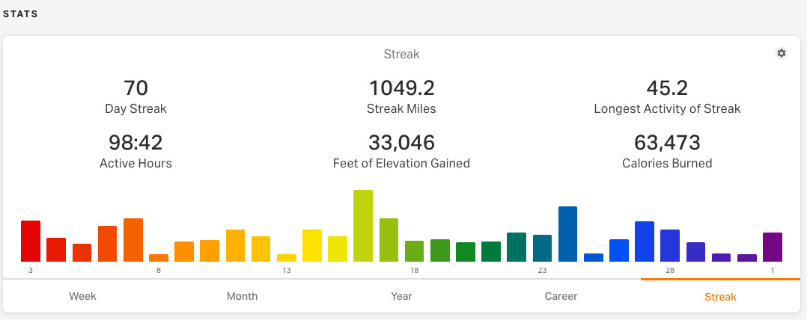

# RWGPS Enhancements Extension

Unofficial enhancements for your ridewithgps.com account.

## Installation

First, download the extension:

1. Go to https://github.com/tomasquinones/rwgps-enhancements-extension in your browser.
2. Click the green **Code** button near the top right of the file list.
3. Click **Download ZIP** from the dropdown.
4. Once downloaded, unzip the file somewhere easy to find, like your Desktop or Documents folder.

### Firefox

5. Type `about:debugging` in the address bar and press Enter.
6. Click **This Firefox** in the left sidebar.
7. Click **Load Temporary Add-on…**
8. Navigate to the unzipped folder and select the `manifest.json` file inside it.
9. The extension is now active and you'll see its icon in the Firefox toolbar.

**Note:** Firefox removes temporary extensions when it's restarted. To re-enable it, repeat steps 5–8.

### Chrome, Vivaldi, Edge, and Brave

5. Open the extensions page:
   - **Chrome / Brave:** `chrome://extensions`
   - **Vivaldi:** `vivaldi://extensions`
   - **Edge:** `edge://extensions`
6. Enable **Developer mode** (toggle in the top-right corner).
7. Click **Load unpacked**.
8. Select the unzipped folder (the folder that contains `manifest.json`).
9. The extension is now active and you'll see its icon in the browser toolbar.

**Note:** The extension stays loaded across browser restarts. After updating the files, click the reload icon on the extension card to pick up changes.

## Features and How to Use Them

### Speed Colors (Trips and Routes)

Open any trip or route page on ridewithgps.com. Click the Speed Colors button that the extension injects into the page. The map track updates to display color coding based on speed.

### Streak Counter (Dashboard)

Navigate to ridewithgps.com/dashboard. Streak stats are added to the Stats card automatically — no action required.

### Activity Graphs (Weekly / Monthly / Yearly / Career / Streak)

Navigate to ridewithgps.com/dashboard. The graphs appear automatically alongside your existing dashboard data.

Use the gear icon in the top-right corner of the Stats card to pick a bar color scheme: **Warm** (orange), **Cool** (the same blue as the Goal graph), or **Pride** (a rainbow spread across the bars). Your choice is remembered and applies to every tab.

### Eddington Number (Career Stats)

Navigate to ridewithgps.com/dashboard and open the **Career** tab in the Stats card. The extension adds a seventh stat tile, **Eddington Number**, next to the native six.

Your Eddington number `E` is the largest number such that you've ridden at least `E` miles on at least `E` separate days — a classic cyclist's measure of sustained mileage that's much harder to grow than a simple total (going from 70 to 71 takes a whole extra day of 71+ miles). It's computed from your entire ride history and follows your unit preference (miles, or km for metric accounts). Hover the tile for a short explanation. For reference, Arthur Eddington — the astrophysicist the number is named for — reached 84.

### Daylight Graph — Past Activities

Open any recorded trip/activity page. The daylight graph appears automatically.

### Daylight Graph — Routes (Planned Rides)

Open any route page. Set your planned start time and date using the controls the extension adds. The graph updates to show expected sun position and daylight window along the route.

### Weather Prediction & History

Toggle Weather from the Enhancements dropdown to see hourly conditions along the ride, plotted in matching segments above the elevation graph. The label changes by context:

- **Weather Prediction** on routes — pick a planned start time in the modal that appears, and the strip fills with forecasted conditions per segment of the ride.
- **Weather History** on activities (trips) — uses the recorded `departed_at`, fetches the historical archive, and shows what the conditions actually were along the way.

Each segment cell shows the time of day, **temperature**, **wind direction + speed** (arrow points the way the wind is blowing), and **cloud cover / rain chance**. A faint cloud/rain wash inside the elevation graph echoes the same data so you can see at a glance which stretches were stormy or overcast. Units follow your RWGPS profile (°F + mph for imperial, °C + km/h for metric). Powered by the Open-Meteo API.

### Highlight Climbs and Descents

Open any trip or route page. Climbs and descents are automatically highlighted on both the map track and the elevation graph.

### Climb Categories (Trips and Routes)

Open any trip or route page and toggle **Climb Categories** in the Enhancements dropdown. Each detected ascent is graded the way pro cycling does — using a score of `length_km × (avg_gradient%)²`, with a minimum elevation gain required for each tier — and sorted into **HC**, **Cat 1**, **Cat 2**, **Cat 3**, or **Cat 4** (gentler climbs stay uncategorized).

Categorized climbs appear as translucent color bands over the elevation graph, from purple (HC) through red, orange, and amber down to green (Cat 4). Hover over a climb and the native tooltip gains a line in the matching color showing the category, average gradient, distance, and elevation gain — for example `Cat 4 — 3.5% · 1.0 mi · 180 ft`. Distance and elevation units follow your RWGPS profile (metric or imperial).

### Goal Graph and Stats

Navigate to any goal detail page on ridewithgps.com (requires a goal set in your RWGPS account). A progress chart with stats cards appears automatically. Supports **Distance**, **Elevation Gain**, and **Moving Time** goals.

The chart shows:

- **Cumulative progress** plotted against the dashed **goal pace line** (straight line from 0 to target).
- **Current-pace projection** — a dashed line extending from today's progress to the goal end date using your average daily rate so far. The endpoint is labeled with the projected total so you can see at a glance whether you're on track.
- **Weekly activity bars** on a secondary Y-axis showing volume per week across the goal window.
- **Stats cards** summarizing Current progress, Daily goal (avg per day needed to finish on target), Projected total, plus an effort row with ride count, total time, elevation gain, and longest ride during the goal window. For Moving Time goals the chart and stats are shown in hours, and "Longest ride" reports the longest ride by moving time.
- A small **?** icon on the chart reveals the formulas used for Daily goal and Projected total.
- A **gear icon** next to it lets you switch the chart palette between **Warm** (orange/red, default) and **Cool** (blue). Your choice is remembered.

### Goals Listing — Past Goal Browser

The native `/goals` page only shows your active goals as a wide list. The extension replaces that section with a 4-column card grid styled like Collections, and adds two more sections below the **Set a goal:** row:

- **Your Goals** — active goals (sorted by soonest deadline)
- **Completed** — expired goals where you reached 100%
- **Incomplete** — expired goals where you didn't

Each card uses the goal's cover/icon image, with name, date range, percent complete, progress bar, and current/target distance (or hours / elevation in your preferred units). Click a card to jump to the goal's detail page.

### Calendar Streak & Goal Indicators

Navigate to ridewithgps.com/calendar.

- **Streak highlights:** Days in your current ride streak are tinted orange. Hover over a highlighted day to see which day of the streak it is (e.g., "Day 15 of 19"). The highlight follows your streak across month boundaries as you navigate.
- **Goal indicators:** Each day cell shows chips for every distance or elevation goal active on that date — both current goals and past goals. Each chip displays the goal's target (e.g., `400 mi`, `3k mi`) with a color unique to the goal. Hover a chip for the goal's full name and date range.

Both overlays can be toggled independently in the popup under the Dashboard group.

### Custom Highlighter Colors

The color pickers for Speed Colors, Climbs, and Descents are built right into the Enhancements dropdown — no system color dialog required. Click any color swatch to open an inline HSV picker with a saturation/brightness gradient and a hue bar. You can also type a hex value directly into the text field.

### Segment Highlights on Tracks

Open any trip or route page that has segments. Segment coverage is automatically overlaid on the map track with colored highlights. Hover over a segment to see its name and stats. Click the start marker (triangle) of any segment to open a popup with more details and a link to the full segment page.

### Quick Laps (Trips, More Menu Tool)

On trip pages, open **More** and click **Quick Laps** (under `rwgps extension`) to start the finish-line lap tool.

### HR Zones (Trips with Heart Rate Data)

Open any trip page that has heart rate data. Toggle **HR Zones** in the Enhancements dropdown. Colored zone bars overlay the elevation graph, spanning the HR value range for each zone (Z1–Z5) so they align with the blue HR trace. Hover over the graph to see the current HR zone in the tooltip alongside elevation, speed, and bpm.

### Sample Time (Trips)

Open any recorded trip page and toggle **Sample Time** in the Enhancements dropdown. RWGPS's native elevation-graph hover tooltip gains a `HH:MM:SS` line showing the local time of day at the point under your cursor — appended below the existing elevation, speed, and HR values. Format follows your browser locale (12-hour with AM/PM in US, 24-hour elsewhere). The toggle is independent of every other feature, so you can see ride times with any or none of the other overlays active. Defaults on for trip pages.

### ET Sample Time (Routes)

Open any route page and toggle **ET Sample Time** in the Enhancements dropdown. The elevation-graph hover tooltip gains an `ET h:mm` line showing the **estimated elapsed time** from the start at the point under your cursor — computed using your RWGPS grade-vs-speed profile (the same profile RWGPS uses for its own time estimates). It is a rough estimate, not a precise prediction. Defaults on for route pages.

### Public Lands Overlay (Planner, Routes, Trips)

Toggle **Public Lands** under the new **Layers** section of the Enhancements dropdown. Translucent polygons appear on the map showing public-lands boundaries:

- **In the US**: National Forest (USFS), National Park (NPS), and BLM-managed surface areas, fetched from each agency's public ArcGIS REST FeatureServer.
- **Elsewhere**: OpenStreetMap `boundary=protected_area` and `boundary=national_park` ways, fetched via the Overpass API.

The layer re-fetches as you pan, with bbox-keyed caching so revisited areas don't re-hit the network. No API keys required. Useful for finding ride-able forest roads, knowing where you can legally bikepack, and avoiding restricted-access areas.

### Weather Radar (Planner, Routes, Trips)

Toggle **Weather Radar** under **Layers** in the Enhancements dropdown. A translucent precipitation-radar overlay appears on the map, sourced from the free public [RainViewer](https://www.rainviewer.com/) API. Shows the latest available frame and auto-refreshes every 5 minutes. Global where radar coverage exists. No API keys required.

### Hill Shading (Trips, Routes, and Planner)

Open any trip, route, or planner page using the RWGPS Cycle map style. Toggle **Hill Shading** in the Enhancements dropdown to adjust terrain shading. The Intensity slider scales the hillshade exaggeration from 0% to 500%, and the Sun Angle slider rotates the illumination direction. Settings persist across navigations. On planner pages, Hill Shading is the only feature available in the Enhancements menu.

### Heatmap Color & Opacity

On any map page with heatmap layers enabled, the extension injects a color picker and opacity slider into the native RWGPS heatmap dropdown for each layer (Global, Rides, Routes). Pick a custom color to make heatmap tiles easier to see, and adjust opacity to blend them with the base map.

